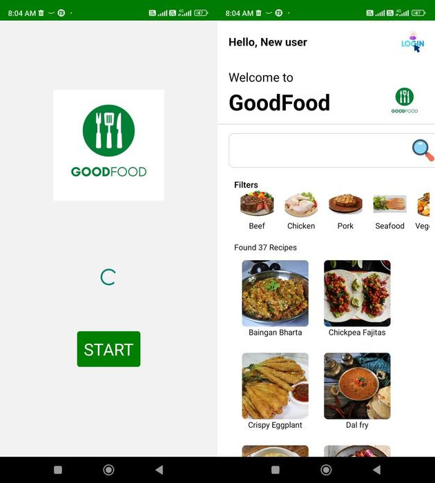
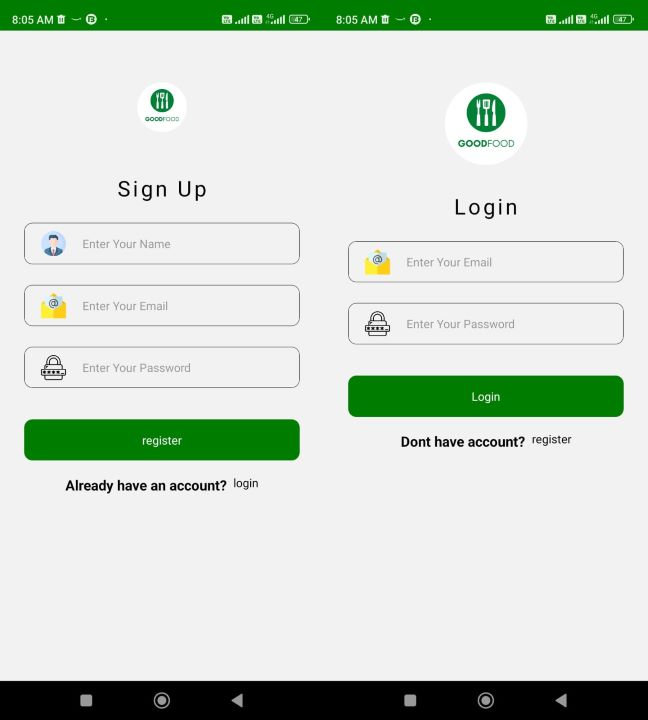
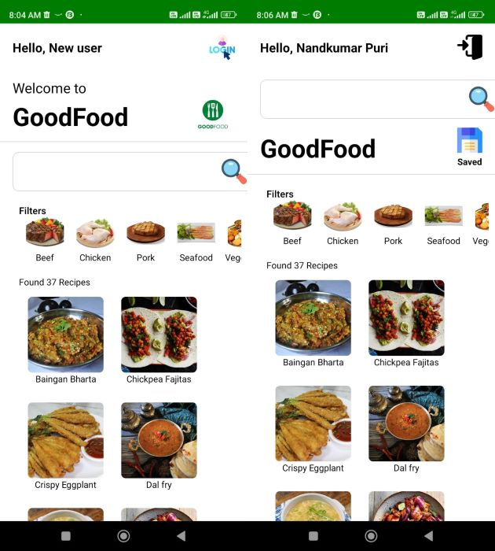

# Recipes App By Rohan Puri
## Features

- Recipes List
- Categories
- Ingredients
- Recipes Details Screen
- Detailed Description
- Search
- Ingredients List
- Recipes by Ingredient
- Search
- Used Stack Menu
- Navigation Bar
- Beautiful UI Design Kit
- Compatible with Expo
- Highly modularized codebase

## Getting Started

To run the app, simply run

`npm install && expo start`

## Download apk

<a href="https://drive.google.com/file/d/1YMwHOzxm9TxPKrNSNoEfPtuSqiVQPygk/view?usp=drivesdk"> Download Now </a>

## Instructions

Wait for few seconds to download

## Open App

## Signup and login

## Without login and With login Home Page

