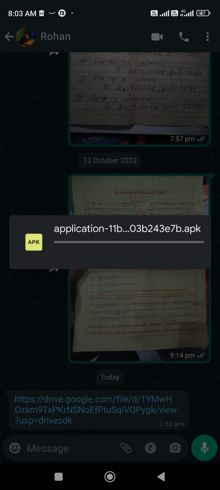

# Recipes App in React Native

## Getting Started

To run the app, simply run

`npm install && expo start`

## Download apk

## Instructions

Wait for few seconds to download

## STEP 2

## Features

- Recipes List
- Categories
- Ingredients
- Recipes Details Screen
- Detailed Description
- Search
- Ingredients List
- Recipes by Ingredient
- Search
- Used Stack Menu
- Navigation Bar
- Beautiful UI Design Kit
- Compatible with Expo
- Highly modularized codebase
